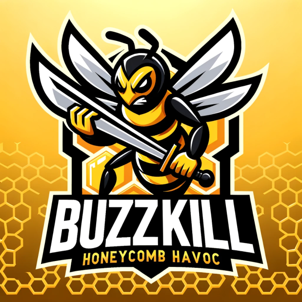

# Buzzkill NFT 🐝 • 

Welcome to Buzzkill, a macroeconomic NFT staking game on the Viction blockchain and in the C98 ecosystem. The beez are collectibles that can be used for various game mechanics for passive or active accrual of tokens.

## Overview

Buzzkill beez earn $honey in hives. Choose wisely where you stake your Bee, as they'll hustle perpetually with enough $honey. Rarity and traits influence a Bee's productivity score, determining their $honey-making abilities.

## Features

- **Productivity Score:** A Bee's $honey and $nectar earnings depend on its rarity and traits.
- **Rarity Metrics:** Full metrics and rankings coming soon to [buzzkillNFT.com](#).
- **Boost Your Bee:** Improve productivity by investing $honey in education. An educated Bee earns more $honey and gains desirability.

## Getting Started

1. **Stake Your Bee:** Choose a hive or field wisely.
2. **Productivity Boost:** Enhance your Bee's productivity with education.
3. **Stay Updated:** Full metrics available soon at [buzzkilNFT.com](#).

## Join the Swarm!

Unleash the power of NFTs on the Viction chain with Buzzkill. Stake your Beez, watch them thrive, and become part of a community that values uniqueness, productivity, and sweet $honey.

For more details, visit [buzzkillNFT.com](#).
